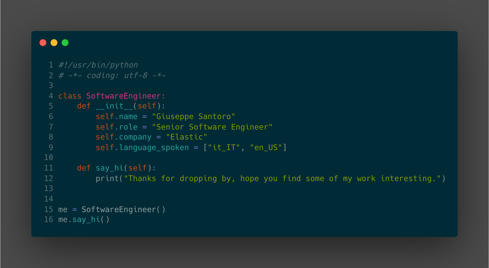

<h1 align="center">Hi 👋, I'm Giuseppe Santoro 👨‍💻</h1>
<!-- <h3 align="center">A passionate Senior Software Engineer from Italy</h3> -->

<!--  -->

  

  

---

  
 Reach me on

  

    
    
    
    
  

  
 Support me on

  

    
  

---

  
 Skills

  
  

    
    
    
    
    
    
    
    
    
  

---

  
 Stackoverlow Stats

  

    
     
    
     
    
     
    
  

  
 Leetcode Stats

  

    
  

  
 Github Stats

  

    
     
    
     
    
     
    
  

